<div align="center">
  
</div>

<div align="center">
    <h1>SAIGOURMET: TASTE THE SOUL OF SAIGON</h1> 
    <strong>SaiGourmet</strong> is a premium restaurant discovery and reservation platform connecting diners with the finest culinary experiences in Ho Chi Minh City. Built with <strong>React</strong> and <strong>TypeScript</strong>, it features role-based authentication, real-time booking validation, and a sophisticated UI styled with <strong>Bootstrap 5</strong>.
</div>

## 📋 Table of Content

1. [Introduction](#introduction)
2. [Getting started](#getting-started)
3. [Technologies Used](#technologies-used)
4. [UI Interface](#ui-interface)
5. [Key Features](#key-features)
6. [Our Team](#our-team)
7. [References](#references)
8. [License](#license)

<!-- Introduction -->
## 🪧 Introduction <a name="introduction"></a>
### 🔗 Link Demo: [saigourmet](https://saigourmet-taste-the-soul-of-saigon.vercel.app/)

**SaiGourmet** streamlines the dining experience by allowing users to explore top-tier restaurants and secure tables instantly. The application ensures a seamless user journey—from browsing restaurant details to managing booking history—while providing administrators with robust tools to oversee reservations.

## 🚀 Getting started <a name="getting-started"></a>

### 🎯 Installation
1. **Clone the repository:**
     ```bash
     git clone https://github.com/yeenci/saigourmet-taste-the-soul-of-saigon.git
     cd saigourmet-taste-the-soul-of-saigon
     ```
2. **Install dependencies:**
     ```bash
     npm install
     ```

### 💨 Running the Application
1. **Start the development server:**
     ```bash
     npm run dev
     ```
2. **Open in browser:**
Navigate to ```http://localhost:5173``` (or 3000) to explore the application.

## ⚙️ Technologies Used <a name="technologies-used"></a>

| Stack | Usage |
|--------|--------|
| **React.js** | Component-based UI library |
| **TypeScript** | Static typing for scalable and error-free code |
| **Bootstrap 5** | Responsive layout and styling framework |
| **React Router v6** | Client-side routing and navigation |
| **Context API** | Global state management for Authentication |
| **REST API** | Backend communication (Axios/Fetch) |
| **FontAwesome** | Icons for UI elements |
| **Vite** | Fast build tool and development server |

## 🎇 UI Interface <a name="ui-interface"></a>

### 🏠 Home:
<div align ="center">
    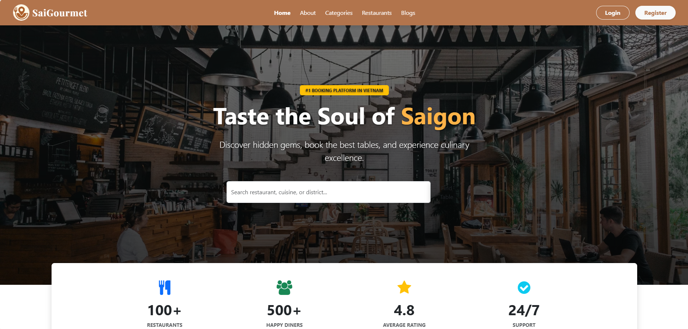
</div>

### ℹ️ About:
<div align ="center">
    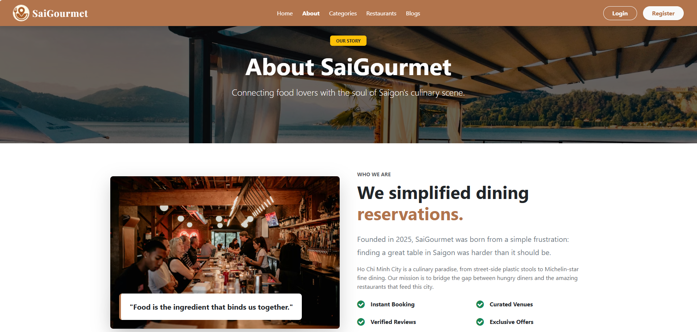
</div>

### 🗝️ Login:
<div align ="center">
    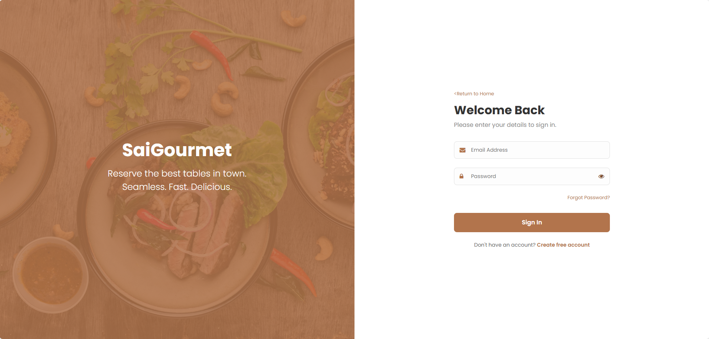
</div>

### 🔐 Register:
<div align ="center">
    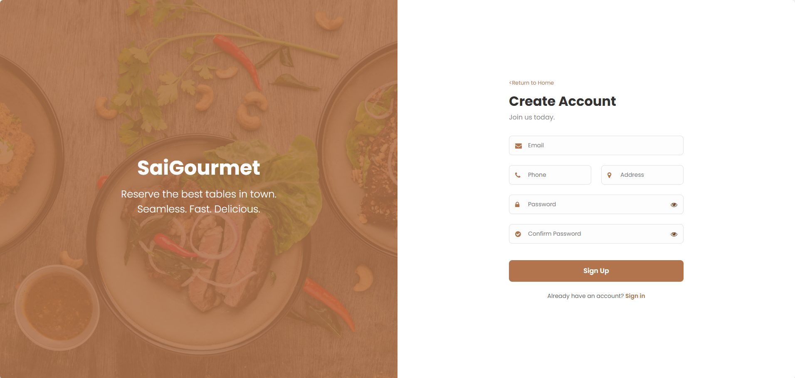
</div>

### 🏷️ All Categories:
<div align ="center">
    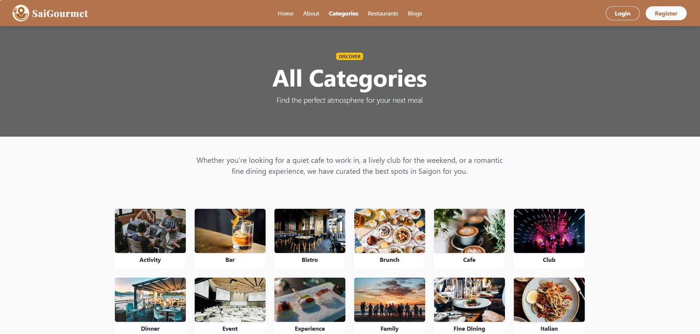
</div>

### 🍝 All Restaurants:
<div align ="center">
    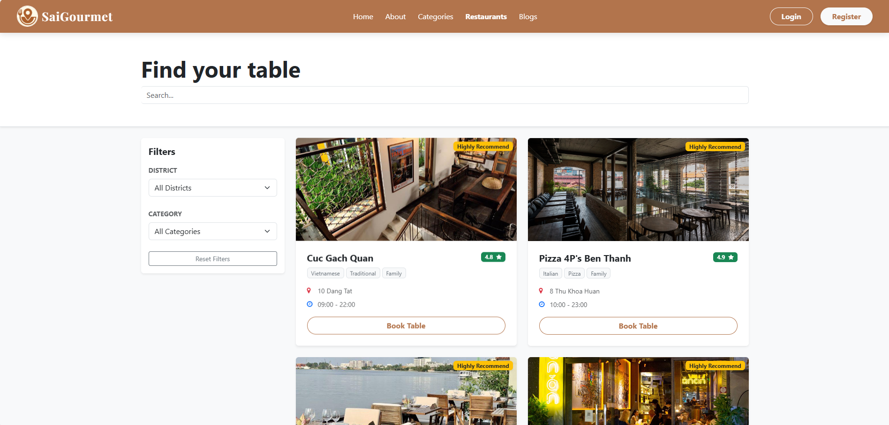
</div>

### 🍶 All Restaurants (Admin View):
<div align ="center">
    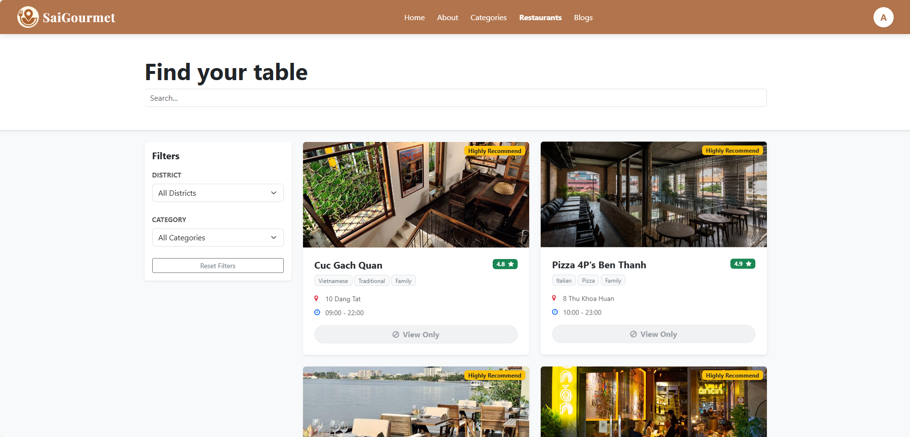
</div>

### 🍞 Create Restaurants (Admin View):
<div align ="center">
    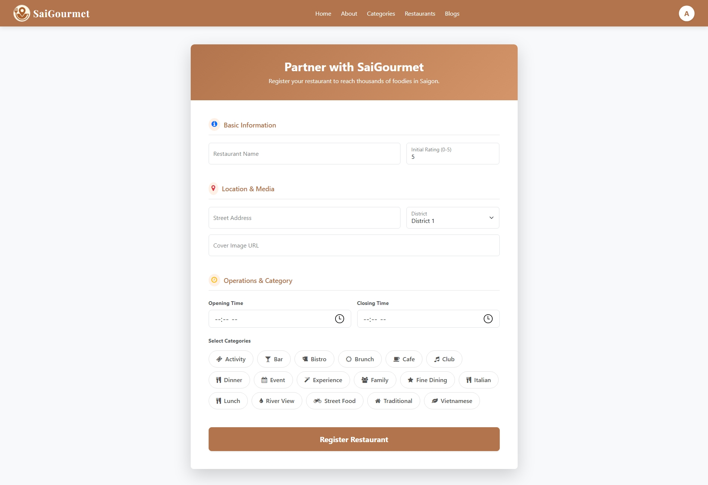
</div>

### 📝 Book Restaurants:
<div align ="center">
    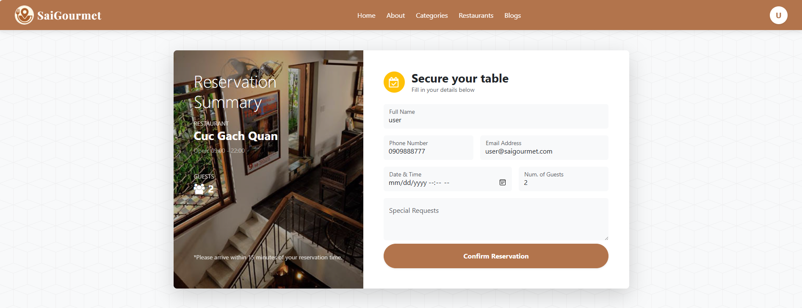
</div>

### 📃 All Blogs:
<div align ="center">
    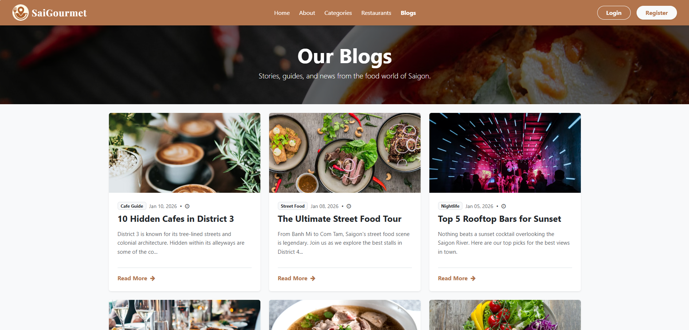
</div>

### 👤 User Profile:
<div align ="center">
    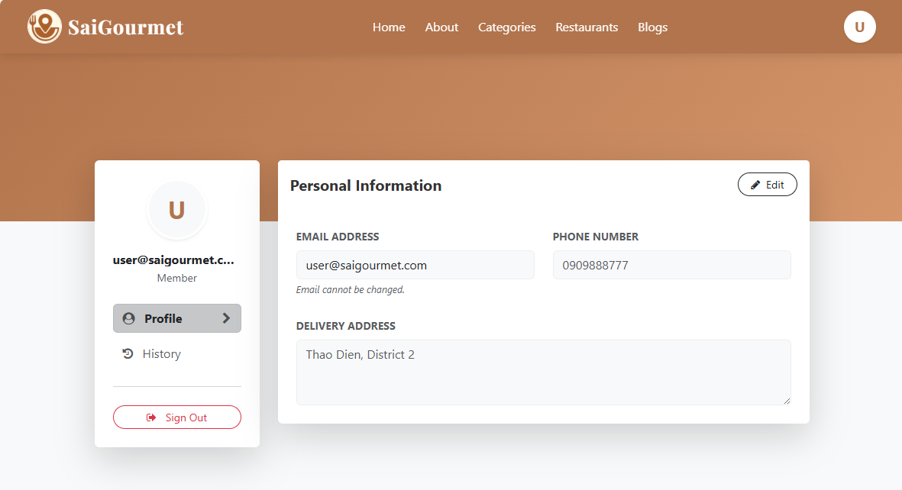
</div>

### 📇 User Booking History:
<div align ="center">
    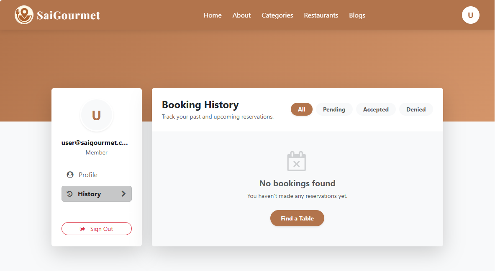
</div>

### 👤 Admin Profile:
<div align ="center">
    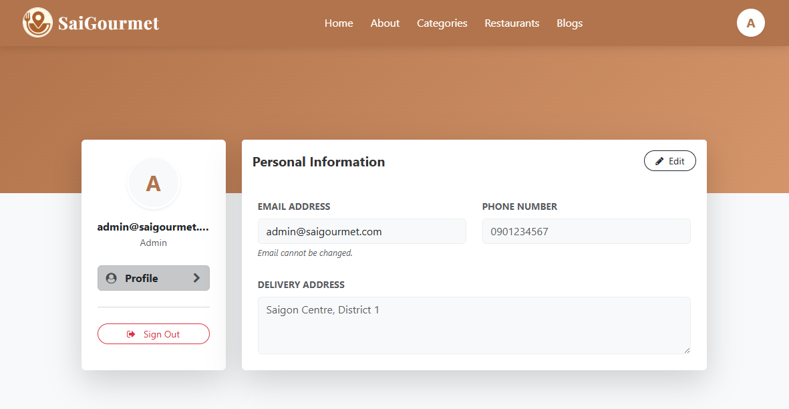
</div>

### 🍚 Admin Restaurants Dashboard:
<div align ="center">
    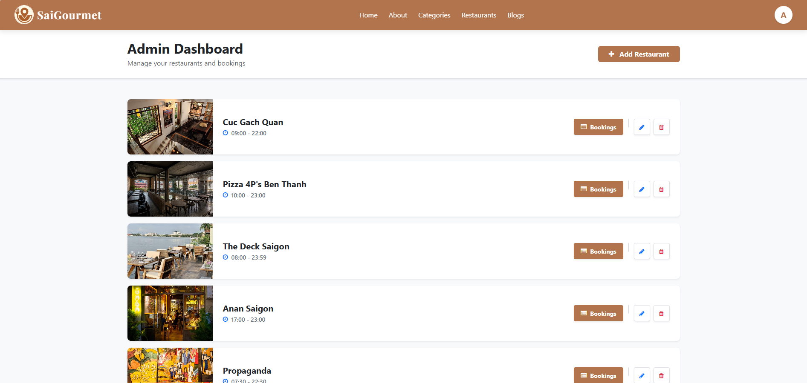
</div>

## 💎 Key Features <a name="key-features"></a>

*   **Role-Based Access Control:** Distinct flows for Customers (Bookings) and Admins (Management).
*   **Smart Validation:** Prevents bookings outside of restaurant hours or in the past.
*   **Security First:** Sensitive profile updates require password re-verification.
*   **Feedback System:** Custom Success, Error, and Attention modals instead of browser alerts.
*   **Responsive Design:** Fully optimized for mobile, tablet, and desktop viewing.

## 👥 Our Team <a name="our-team"></a>

This project was built with ❤️ by a team of 6 dedicated developers.

| No. | Member Name | Role |
|:---:|:-----------|:-----|
| 1 | **Nguyen Thi Yen Chi** | Frontend Developer |
| 2 | **Tram Le Manh** | Backend Developer |
| 3 | **Chau Thanh Phat** | UI/UX Designer |
| 4 | **Vo Nguyen Thanh Liem** | Backend Developer |
| 5 | **Gonzalez Marcos Delgado** | Backend Developer |
| 6 | **Nguyen Quang Minh Tri** | Backend Developer |

## 📚 References <a name="references"></a>

- [React Documentation](https://react.dev/)
- [Bootstrap 5 Documentation](https://getbootstrap.com/docs/5.0/getting-started/introduction/)
- [React Router](https://reactrouter.com/en/main)
- [TypeScript Docs](https://www.typescriptlang.org/)

## 📜 License <a name="license"></a>

This project is licensed under the [MIT License](LICENSE).